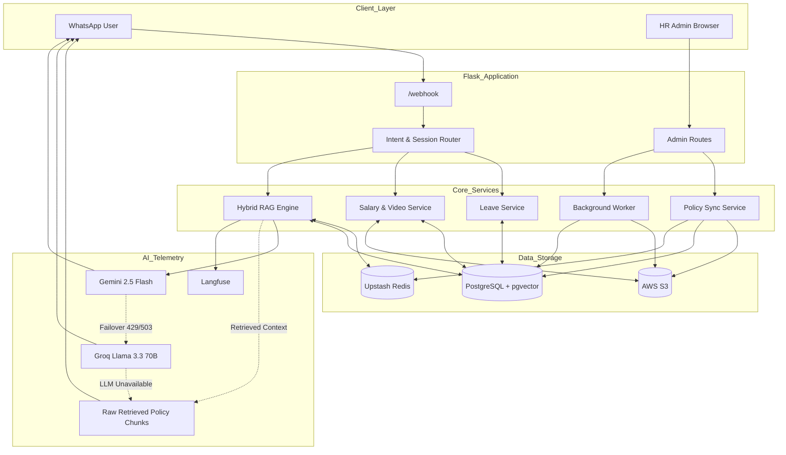
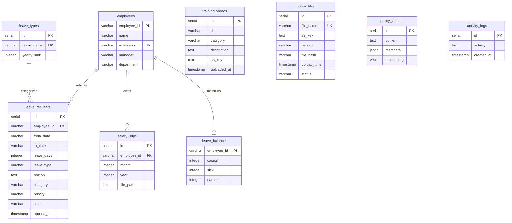

# 🏢 Enterprise AI HR Assistant

### WhatsApp Hybrid RAG Chatbot with Flask Admin Portal

An enterprise-grade, multi-turn AI-powered HR Assistant available through **WhatsApp**, with a centralized **Flask-based Admin Portal** for employee management, leave approvals, payroll, policies, training materials, and system monitoring.

---

## 📖 Overview

Managing employee questions about HR policies, leave balances, payslips, and training resources can create repetitive workloads for HR teams.

The **Enterprise AI HR Assistant** provides a self-service HR platform where employees can interact with an AI assistant directly through WhatsApp, while HR administrators manage employees, leave requests, payroll documents, policies, and training content through a web-based dashboard.

### What It Does

* Answers HR policy-related questions using a **Hybrid RAG pipeline**
* Provides real-time employee leave balances and history
* Supports multi-turn leave application workflows
* Classifies leave requests using deterministic rules
* Delivers password-protected payslips
* Provides training videos through WhatsApp
* Allows HR managers to approve/reject leave requests
* Provides centralized employee and payroll management
* Tracks AI requests using **Langfuse observability**
* Uses semantic caching to reduce response latency and LLM costs

### Target Users

* 👨‍💼 Employees — interact through WhatsApp
* 👩‍💼 HR Administrators — manage the system through the web portal
* 👔 HR Managers — review and approve employee leave requests

---

# ✨ Key Features

## 💬 WhatsApp AI Assistant

### Interactive Menu

Employees can navigate the assistant using WhatsApp interactive lists and buttons.

### Multi-Turn Leave Application

The assistant collects leave information step-by-step:

```text
Employee
   ↓
Leave Type
   ↓
Start Date
   ↓
End Date
   ↓
Reason
   ↓
Confirmation
   ↓
Leave Request Created
```

### Leave Classification

Leave requests are classified into categories such as:

* Casual Leave
* Sick Leave
* Critical Leave

Policy rules are validated before submitting the request.

### Leave Balance & History

Employees can check:

* Remaining leave balance
* Previous leave applications
* Application status
* Leave history

### 🔐 Secure Payslip Delivery

Payslips are encrypted before storage and delivery.

Password format:

```text
<EMPLOYEE_ID>@<LAST_4_DIGITS_OF_PHONE>
```

Payslips are stored in AWS S3 and can be delivered using secure presigned URLs.

### 🎓 Training Videos

Employees can request training content by category, including:

* Safety
* Health Insurance
* Induction

---

# 🧠 Hybrid RAG Pipeline

The system uses a **Hybrid Retrieval-Augmented Generation (RAG)** architecture combining semantic and keyword search.

### Dense Retrieval

Uses:

* PostgreSQL
* `pgvector`
* HNSW indexing
* FastEmbed
* `sentence-transformers/all-MiniLM-L6-v2`
* Cosine similarity

### Sparse Retrieval

Uses:

* BM25Okapi
* `rank-bm25`
* In-memory keyword search

### Multi-Query Expansion

The system generates alternative versions of the employee's question to improve retrieval recall.

### Reciprocal Rank Fusion

Dense and sparse retrieval results are combined using **Reciprocal Rank Fusion (RRF)**.

```text
                User Question
                      │
                      ▼
              Query Expansion
                      │
             ┌────────┴────────┐
             ▼                 ▼
       Dense Retrieval    Sparse Retrieval
        pgvector              BM25
             │                 │
             └────────┬────────┘
                      ▼
                 RRF Ranking
                      │
                      ▼
               Relevant Context
                      │
                      ▼
                 LLM Generation
                      │
                      ▼
              WhatsApp Response
```

### ⚡ Semantic Caching

Frequently repeated or semantically similar questions are cached using Upstash Redis.

Cache similarity threshold:

```text
≥ 0.92
```

This helps reduce:

* LLM API calls
* Response latency
* Token consumption
* Infrastructure costs

### 🔄 Cascading LLM Failover

The primary LLM is:

```text
Google Gemini 2.5 Flash
```

If Gemini encounters rate limits or service availability issues (`429` / `503`), the system automatically falls back to:

```text
Groq
└── llama-3.3-70b-versatile
```

If both LLM providers are unavailable, the system can return formatted raw policy chunks instead of failing completely.

---

# 🖥️ Flask Admin Portal

HR administrators can manage the HR system through a web-based dashboard.

### 📊 Dashboard

Provides operational information including:

* Employee headcount
* Pending leave requests
* Payroll upload statistics
* Activity logs
* System activity

### 👥 Employee Management

Administrators can:

* Add employees
* Edit employee information
* Remove employees
* Search employees
* View employee leave information

### ✅ Leave Approval

Managers can:

* View leave requests
* Approve requests
* Reject requests
* Trigger WhatsApp notifications to employees

### 💰 Payroll Management

Supports:

* Individual payslip uploads
* Bulk ZIP uploads
* PDF encryption
* S3 storage
* Background processing

### 📚 Policy Management

Administrators can:

* Upload HR policy PDFs
* Store policies in AWS S3
* Extract policy text
* Split documents into chunks
* Generate embeddings
* Store vectors in PostgreSQL
* Delete policies
* Invalidate semantic cache

### 🎓 Training Management

Administrators can:

* Upload training videos
* Assign categories
* Add descriptions
* Manage stored videos

---

# 📡 Observability

The system integrates **Langfuse** for AI observability and telemetry.

Tracked information includes:

* Retrieval latency
* LLM generation latency
* Token usage
* Cache hits
* Generation traces
* Retrieval information
* Feedback scores
* OpenTelemetry-compatible spans

This makes it easier to monitor and debug the RAG pipeline in production.

---

# 🔄 Application Workflow

The complete request lifecycle is:

```text
Employee
   │
   │ WhatsApp Message
   ▼
WhatsApp Cloud API
   │
   ▼
Flask /webhook
   │
   ▼
Authentication & Rate Limiting
   │
   ▼
Intent & Session Router
   │
   ├───────────────┬────────────────┬─────────────────┐
   ▼               ▼                ▼                 ▼
 Leave           Payroll         Training          Policy
   │               │                │                 │
   ▼               ▼                ▼                 ▼
Leave Service   Media Service   Media Service     Hybrid RAG
   │               │                │                 │
   ▼               ▼                ▼                 ▼
PostgreSQL       PostgreSQL       AWS S3        Redis + pgvector
                                                    │
                                                    ▼
                                             BM25 + Dense Search
                                                    │
                                                    ▼
                                                RRF Ranking
                                                    │
                                                    ▼
                                          Gemini / Groq LLM
                                                    │
                                                    ▼
                                              Final Answer
                                                    │
                    ┌───────────────────────────────┘
                    ▼
             WhatsApp Response
                    │
                    ▼
              Langfuse Trace
```

---

# 🏗️ System Architecture



---

# 💻 Tech Stack

| Category        | Technology              | Purpose                                |
| --------------- | ----------------------- | -------------------------------------- |
| Backend         | Python 3.11             | Application development                |
| Web Framework   | Flask                   | Web server, webhook, admin portal      |
| Frontend        | HTML5, CSS3, JavaScript | Admin dashboard                        |
| Templates       | Jinja2                  | Server-side HTML rendering             |
| Database        | PostgreSQL              | Application data storage               |
| Vector Database | pgvector                | Policy embeddings and vector search    |
| Vector Index    | HNSW                    | Approximate nearest-neighbor search    |
| Database Driver | psycopg2-binary         | PostgreSQL connectivity                |
| Embeddings      | FastEmbed               | Document/query embeddings              |
| Embedding Model | all-MiniLM-L6-v2        | 384-dimensional embeddings             |
| Sparse Search   | rank-bm25               | Keyword retrieval                      |
| Cache           | Upstash Redis           | Semantic cache and conversation memory |
| Queue           | Redis Queue (RQ)        | Background jobs                        |
| Object Storage  | AWS S3                  | Policies, payslips and training videos |
| Primary LLM     | Google Gemini 2.5 Flash | Response generation                    |
| Secondary LLM   | Groq                    | LLM failover                           |
| PDF Processing  | pypdf                   | PDF processing                         |
| PDF Encryption  | AES-128                 | Payslip protection                     |
| Messaging       | Meta WhatsApp Cloud API | Employee communication                 |
| Observability   | Langfuse                | AI tracing and monitoring              |
| Telemetry       | OpenTelemetry           | Distributed tracing                    |

---

# 📁 Project Structure

```text
.
├── app/
│   ├── routes/
│   │   └── admin_routes.py
│   │
│   ├── services/
│   │   ├── auth_service.py
│   │   ├── intent_service.py
│   │   ├── leave_service.py
│   │   ├── media_service.py
│   │   ├── memory_service.py
│   │   ├── policy_sync_service.py
│   │   ├── rag_service.py
│   │   ├── s3_service.py
│   │   ├── semantic_cache_service.py
│   │   ├── setup_pgvector.py
│   │   ├── telemetry_service.py
│   │   └── whatsapp_service.py
│   │
│   ├── tasks/
│   │   ├── salary_tasks.py
│   │   └── worker_tasks.py
│   │
│   └── utils/
│       └── pdf_security.py
│
├── eval/
│   ├── benchmark_data.json
│   └── run_evaluation.py
│
├── scripts/
│
├── static/
│   ├── css/
│   │   └── style.css
│   └── js/
│
├── templates/
│   ├── base.html
│   ├── login.html
│   ├── dashboard.html
│   ├── employees.html
│   ├── add_employee.html
│   ├── edit_employee.html
│   ├── leave_requests.html
│   ├── upload_salary.html
│   ├── policy_management.html
│   └── upload_video.html
│
├── config.py
├── database.py
├── leave_session.py
├── main.py
├── rate_limiter.py
├── validators.py
├── clear_all_cache.py
├── requirements.txt
├── .env.example
└── README.md
```

---

# 📋 Prerequisites

Before running the application, install/configure:

* Python 3.11+
* PostgreSQL 15+
* PostgreSQL `pgvector` extension
* Redis
* AWS account
* Meta Developer account
* Google AI Studio API key
* Groq API key
* Upstash Redis
* Langfuse account

---

# ⚙️ Installation

## 1. Clone the Repository

```bash
git clone <repository-url>
cd <project-folder>
```

## 2. Create Virtual Environment

### Windows

```bash
python -m venv venv
venv\Scripts\activate
```

### Linux / macOS

```bash
python3 -m venv venv
source venv/bin/activate
```

## 3. Install Dependencies

```bash
pip install -r requirements.txt
```

## 4. Configure Environment Variables

Create your environment file:

```bash
cp .env.example .env
```

On Windows, you can manually copy `.env.example` to `.env`.

Then configure the required credentials.

---

# 🔐 Environment Variables

Create a `.env` file containing the required configuration.

| Variable                   | Description                         |
| -------------------------- | ----------------------------------- |
| `DATABASE_URL`             | PostgreSQL connection string        |
| `REDIS_URL`                | Redis URL used for background jobs  |
| `UPSTASH_REDIS_REST_URL`   | Upstash Redis REST endpoint         |
| `UPSTASH_REDIS_REST_TOKEN` | Upstash Redis authentication token  |
| `GEMINI_API_KEY`           | Google Gemini API key               |
| `GROQ_API_KEY`             | Groq API key                        |
| `AWS_ACCESS_KEY_ID`        | AWS access key                      |
| `AWS_SECRET_ACCESS_KEY`    | AWS secret access key               |
| `AWS_REGION`               | AWS region                          |
| `S3_BUCKET_NAME`           | S3 bucket name                      |
| `S3_POLICY_PREFIX`         | S3 policy directory                 |
| `WHATSAPP_TOKEN`           | WhatsApp Cloud API token            |
| `PHONE_NUMBER_ID`          | WhatsApp Business phone number ID   |
| `VERIFY_TOKEN`             | WhatsApp webhook verification token |
| `LANGFUSE_PUBLIC_KEY`      | Langfuse public key                 |
| `LANGFUSE_SECRET_KEY`      | Langfuse secret key                 |
| `LANGFUSE_BASE_URL`        | Langfuse server URL                 |
| `SECRET_KEY`               | Flask session secret                |
| `PORT`                     | Application port                    |

> ⚠️ **Never commit ****`.env`**** or any real credentials to GitHub.**

Add the following to `.gitignore`:

```gitignore
.env
venv/
__pycache__/
*.pyc
```

---

# 🗃️ Database Setup

The application uses PostgreSQL with the `pgvector` extension.

Initialize the vector database and policy index:

```bash
python app/services/setup_pgvector.py
```

This prepares the vector infrastructure and indexes policy documents.

---

# 🚀 Running the Application

## 1. Start Redis

Make sure Redis is running locally.

## 2. Start the RQ Worker

Open a separate terminal:

```bash
rq worker hr_tasks --url redis://localhost:6379/0
```

## 3. Start Flask

Open another terminal:

```bash
python main.py
```

The application will then be available at:

```text
Admin Portal:
http://localhost:5000/admin

Webhook:
http://localhost:5000/webhook

Health Check:
http://localhost:5000/health
```

---

# 📡 API Documentation

## Webhook & Public Endpoints

| Method | Endpoint             | Description                      | Authentication     |
| ------ | -------------------- | -------------------------------- | ------------------ |
| GET    | `/webhook`           | WhatsApp webhook verification    | Verification Token |
| POST   | `/webhook`           | Receives WhatsApp messages       | Meta Webhook       |
| GET    | `/health`            | Health check                     | None               |
| GET    | `/videos/<filename>` | Serves video files if configured | None               |

---

## Admin Endpoints

| Method   | Endpoint                  | Description           |
| -------- | ------------------------- | --------------------- |
| GET/POST | `/admin/login`            | Admin authentication  |
| GET      | `/admin/logout`           | Logout                |
| GET      | `/admin`                  | Dashboard             |
| GET      | `/employees`              | Employee directory    |
| GET/POST | `/add-employee`           | Add employee          |
| GET/POST | `/edit-employee/<id>`     | Edit employee         |
| GET      | `/delete-employee/<id>`   | Delete employee       |
| GET      | `/leave-requests`         | View leave requests   |
| GET      | `/approve-leave/<id>`     | Approve leave         |
| GET      | `/reject-leave/<id>`      | Reject leave          |
| GET/POST | `/upload-salary`          | Upload payslip        |
| POST     | `/upload-bulk-salary`     | Bulk payslip upload   |
| GET      | `/view-salary/<id>`       | View payslip          |
| GET      | `/delete-salary/<id>`     | Delete payslip        |
| GET/POST | `/policy-management`      | Manage policies       |
| GET      | `/download-policy/<name>` | Download policy       |
| GET      | `/view-policy/<name>`     | View policy           |
| GET/POST | `/upload-video`           | Upload training video |
| GET/POST | `/delete-video/<id>`      | Delete training video |

---

# 🗄️ Database Schema

The main entities include:



---

# 🔒 Authentication & Security

## Admin Authentication

The Admin Portal uses session-based authentication.

Unauthenticated users attempting to access protected routes are redirected to:

```text
/admin/login
```

## WhatsApp User Authentication

Employees are identified using their registered WhatsApp phone number.

The system verifies the phone number against the employee database before allowing access to HR functionality.

## Payslip Security

Payslip PDFs are encrypted before being stored or delivered.

Password format:

```text
<EMPLOYEE_ID>@<LAST_4_DIGITS_OF_PHONE>
```

## Additional Security Measures

The system includes:

* Parameterized PostgreSQL queries
* Environment-based secrets
* Rate limiting
* Duplicate webhook suppression
* Protected admin routes
* Private S3 storage
* Presigned URLs for secure file access
* PDF encryption

---

# 🧪 Testing & Evaluation

The project includes an evaluation framework for measuring the RAG system.

Evaluation dataset:

```text
25 ground-truth questions
```

Run the evaluation:

```bash
python eval/run_evaluation.py
```

## Evaluation Metrics

### Hit Rate @ 5

Measures whether the correct policy chunk appears within the top five retrieved results.

### Mean Reciprocal Rank

Measures how highly the relevant document appears in the retrieval results.

### Faithfulness

Measures whether the generated answer is grounded in the retrieved context.

### Answer Relevancy

Measures how effectively the generated answer addresses the user's question.

---

# 🛡️ Error Handling

The application includes several fallback mechanisms.

## LLM Failover

```text
Gemini
   │
   │ 429 / 503
   ▼
Groq
   │
   │ Failure
   ▼
Raw Retrieved Policy Chunks
```

## Rate Limiting

Requests are rate-limited per WhatsApp sender to reduce abuse.

## Duplicate Webhooks

WhatsApp webhook message IDs are temporarily cached to prevent duplicate processing.

## Input Validation

User input is validated before processing.

Database queries use parameterized SQL through `psycopg2`.

---

# ⚡ Performance & Scalability

### Semantic Caching

Semantically similar queries can be served from Redis without invoking an LLM.

Configured similarity threshold:

```text
0.92
```

### HNSW Vector Search

HNSW indexing enables efficient approximate nearest-neighbor searches across policy embeddings.

### Background Processing

Heavy operations are moved to background workers, including:

* Bulk payslip encryption
* ZIP processing
* PDF processing
* Policy ingestion
* Embedding generation

This prevents long-running operations from blocking the main web application.

---

# 📈 Scalability Considerations

For production environments, the application can be extended by:

* Moving conversation sessions from memory to Redis
* Moving rate limiting to Redis
* Running multiple Flask instances
* Running dedicated RQ worker instances
* Using managed PostgreSQL
* Using private S3 buckets
* Adding centralized logging
* Adding container orchestration

---

# 🚀 Deployment

The Flask application can be deployed using Gunicorn.

```bash
gunicorn -w 4 -b 0.0.0.0:5000 main:app
```

The RQ worker can run separately:

```bash
rq worker hr_tasks --url $REDIS_URL
```

### Recommended Production Components

```text
                    Internet
                       │
                       ▼
                Reverse Proxy
                       │
              ┌────────┴────────┐
              ▼                 ▼
        Flask Instances     RQ Workers
              │                 │
              └────────┬────────┘
                       │
        ┌──────────────┼──────────────┐
        ▼              ▼              ▼
   PostgreSQL       Redis            AWS S3
    + pgvector
        │
        ▼
  Policy Vectors
```

Possible infrastructure options include:

* Render
* Railway
* AWS EC2
* Neon
* Supabase
* AWS RDS
* AWS S3

---

# 🖼️ Screenshots

Add screenshots to the repository under:

```text
screenshots/
```

Recommended screenshots:

### Admin Login

```markdown

```

### Dashboard

```markdown

```

### Employee Management

```markdown

```

### Leave Approval

```markdown

```

---

# 🔮 Future Improvements

The following features can be added in future versions:

* [ ] Multi-language WhatsApp responses
* [ ] OAuth2 / Google Workspace SSO
* [ ] Automated WhatsApp policy broadcasts
* [ ] Voice-note support with speech-to-text
* [ ] Redis-based distributed session management
* [ ] Distributed rate limiting
* [ ] Advanced HR analytics
* [ ] Role-based admin permissions
* [ ] Automated policy update notifications

---

# ⚠️ Known Limitations

### In-Memory Leave Sessions

Active multi-turn leave sessions are currently stored in memory.

```text
leave_session.py
```

Therefore, active sessions may be lost if the application restarts.

### In-Memory Rate Limiting

Rate limiter state is stored in memory and does not automatically synchronize across multiple application instances.

For horizontal scaling, these components should be moved to Redis.

---

# 🤝 Contributing

Contributions are welcome.

## 1. Fork the Repository

Create your own fork of the project.

## 2. Create a Feature Branch

```bash
git checkout -b feature/your-feature
```

## 3. Make Your Changes

Implement and test your changes.

## 4. Commit

```bash
git add .
git commit -m "Add your feature description"
```

## 5. Push

```bash
git push origin feature/your-feature
```

## 6. Open a Pull Request

Create a Pull Request with a clear description of your changes.

---

# 📄 License

License: **Not specified**

---

# 👤 Author

**[Your Name]**

---

# 🙏 Acknowledgements

This project uses and builds upon several excellent technologies and open-source projects:

* Meta WhatsApp Cloud API
* PostgreSQL
* pgvector
* FastEmbed
* BM25
* Google Gemini
* Groq
* AWS S3
* Upstash Redis
* Redis Queue
* Flask
* Langfuse
* OpenTelemetry

---

# 🏷️ GitHub Topics

```text
whatsapp-chatbot
ai-assistant
rag
hybrid-search
pgvector
bm25
semantic-search
gemini
groq
flask
hrms
human-resources
semantic-cache
fastembed
redis
redis-queue
aws-s3
langfuse
opentelemetry
python
```

---

# ⭐ Project Summary

**Enterprise AI HR Assistant** combines conversational AI, WhatsApp, Hybrid RAG, PostgreSQL/pgvector, Redis, AWS S3, and Langfuse to provide a secure and scalable HR self-service platform.

The system enables employees to access HR information and services through a familiar WhatsApp interface while giving HR teams centralized control through a dedicated administration portal.

```text
WhatsApp
    │
    ▼
AI HR Assistant
    │
    ├── HR Policy Q&A
    ├── Leave Management
    ├── Leave Balance
    ├── Payslip Access
    └── Training Videos
    │
    ▼
Hybrid RAG + Enterprise Data
    │
    ├── PostgreSQL + pgvector
    ├── BM25
    ├── Upstash Redis
    ├── AWS S3
    ├── Gemini
    ├── Groq
    └── Langfuse
```

**Built with Python, Flask, PostgreSQL, pgvector, Redis, AWS S3, Gemini, Groq, and Langfuse.**
